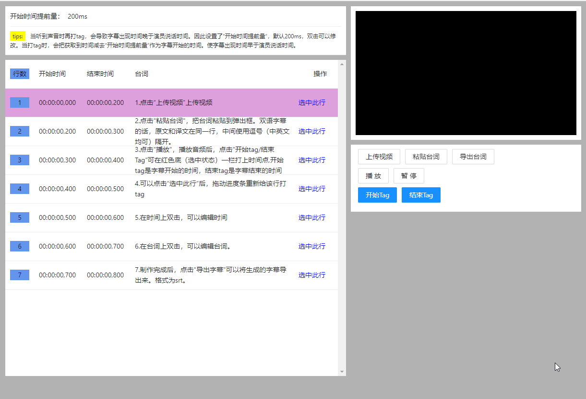
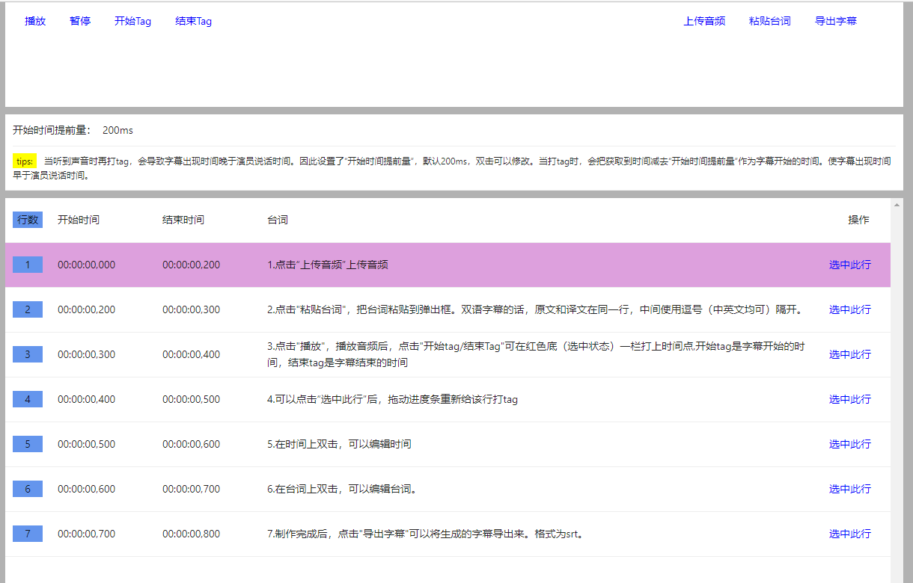

### 项目介绍

使用react开发的，在线制作srt格式字幕的网站。

### 使用技术

前端使用react、antd等工具。后端使用阿里云oss静态网站托管。
### 网站地址

[一个真正的免费的在线制作srt格式字幕的网站](http://srt.mfish.xyz/)

### 命令

开发 `yarn start | npm run start`

打包 `yarn build | npm run build`

### 页面截图

首页

视频制作字幕

音频制作字幕

